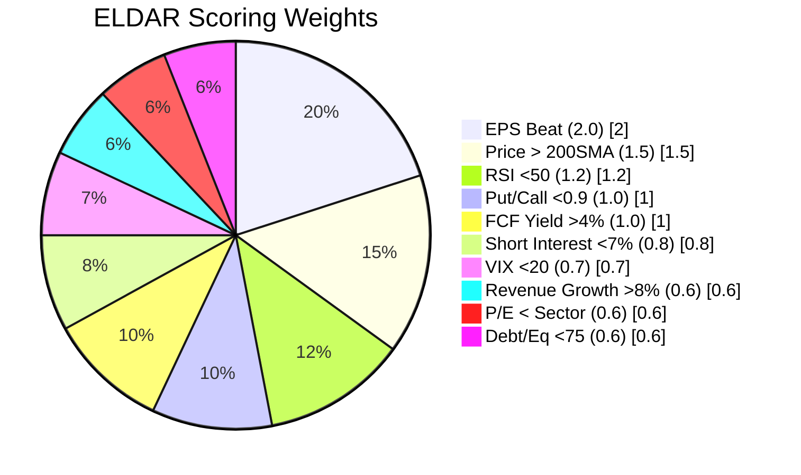
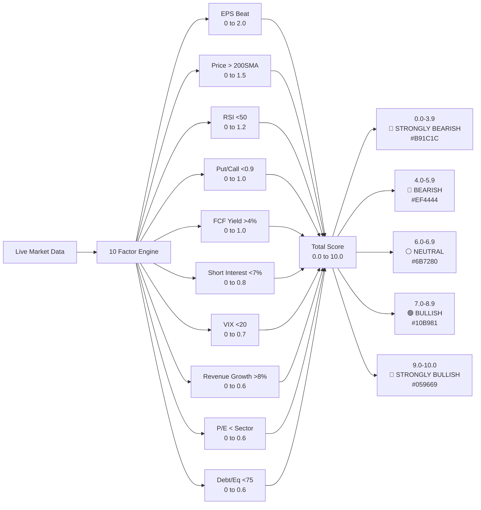

# ELDAR Metrics Graph

## 1) 10-Factor Weight Distribution (Total = 10.0)

## 2) How the ELDAR Score is Produced

## 3) Rating Bands (Quick Copy)

| Score Range | Label | Color |
|---|---|---|
| 0.0-3.9 | 🐻 STRONGLY BEARISH | `#B91C1C` |
| 4.0-5.9 | 🔴 BEARISH | `#EF4444` |
| 6.0-6.9 | ⚪ NEUTRAL | `#6B7280` |
| 7.0-8.9 | 🟢 BULLISH | `#10B981` |
| 9.0-10.0 | 🐂 STRONGLY BULLISH | `#059669` |
