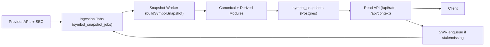

# ELDAR Production Snapshot Architecture

## A. Architecture Overview

ELDAR now follows a strict snapshot-first serving model:

1. Distributed Ingestion Layer
2. Canonical Data Layer
3. Derived Analytics Layer
4. Snapshot Builder
5. Read Layer (API)

User APIs consume `symbol_snapshots` only and enqueue background refresh when stale/missing.

## B. Snapshot Schema Design

Contract: `src/lib/snapshots/contracts.ts`

Core object: `SymbolSnapshotContract`

Modules:

1. `analysis` (precomputed rating payload)
2. `fundamentals` (canonical financial health from SEC pipeline)
3. `context` (sector-level comparison metadata)
4. `news` (pre-fetched headline set or sector fallback)

Per-module metadata:

1. `freshnessClass`
2. `builtAt`
3. `expiresAt`
4. `source`
5. `warnings`

Storage: `symbol_snapshots` table in Postgres (JSON snapshot + per-module expiry columns for operational querying).

## C. Data Pipeline Diagram

## D. Concurrency and Locking Strategy

1. Queue claim uses DB row locking (`FOR UPDATE SKIP LOCKED`) for distributed workers.
2. Ticker-level distributed build lock via Redis key (`snapshots:lock:{symbol}`) with TTL.
3. Lock release is token-guarded (delete only if lock token matches).
4. Duplicate queue requests are deduped by symbol when active queued/running jobs exist.

## E. Caching Strategy

1. API returns latest snapshot immediately.
2. If stale/missing, API enqueues refresh but does not wait.
3. Existing in-memory and Redis caches remain valid as edge accelerators.
4. Legacy analysis rows remain fallback-only for cold-start safety.

## F. Observability Plan

Metrics endpoint: `/api/system/snapshots/metrics`

Tracked:

1. Queue depth by state (`queued`, `running`, `dead`)
2. Snapshot total count
3. Snapshot stale count

Operational endpoints:

1. `/api/system/snapshots/dead-letter`
2. `/api/system/snapshots/rebuild`
3. `/api/cron/snapshots`

## G. Failure Handling Plan

Graceful degradation rules:

1. If snapshot missing: enqueue refresh and return warmup response (no upstream calls in request path).
2. If snapshot stale: serve stale snapshot and enqueue refresh.
3. If module unavailable: degrade module only; keep response shape deterministic.
4. If worker failures persist: move job to dead-letter with attempts/error trace.

Provider isolation:

1. SEC budget per minute
2. Market budget per minute
3. Budget overrun degrades to cached/fallback module outputs

## H. Phased Implementation Roadmap

Phase 1 (implemented):

1. Snapshot contract + schema
2. Queue/job store
3. Worker claim/complete/fail/retry/dead-letter
4. Redis lock + provider budget controls
5. Snapshot read service with SWR enqueue
6. `/api/rate` and `/api/context` moved to snapshot read flow
7. Ops routes for worker, metrics, dead-letter, manual rebuild

Phase 2 (implemented):

1. Move dashboard/sector/movers/macro APIs to aggregate snapshot read flow
2. Add snapshot warmup cron (`/api/cron/snapshots/warmup`) for hot symbols + aggregate keys
3. Add queue lag + build latency metrics (`avgQueuedAgeSec`, `p50BuildMs`, `p95BuildMs`)
4. Add dead-letter replay control (`/api/system/snapshots/replay`)

Phase 3:

1. Filing-event triggered incremental rebuilds
2. Module-level partial rebuild jobs
3. Full replay tooling by date range/provider

## Freshness Classes

Defined in `src/lib/snapshots/contracts.ts`:

1. `MARKET_LIVE` - 30s
2. `MARKET_INTRADAY` - 5m
3. `FUNDAMENTALS_DAILY` - 24h
4. `SEC_EVENT` - 24h (event-driven refresh source)
5. `ANALYTICS_SCHEDULED` - 60m

## Queue Priority Policy

Defined in `SNAPSHOT_PRIORITY_SCORE`:

1. `hot` = 100
2. `portfolio` = 80
3. `watchlist` = 60
4. `scheduled` = 40
5. `repair` = 20

## Performance Targets

Read path targets:

1. p50 API latency < 100ms
2. p95 API latency < 300ms

Background targets:

1. Snapshot worker batch latency observable per run
2. Dead-letter rate near-zero under normal provider health
3. Stale ratio controlled via scheduled warmups and priority queueing
